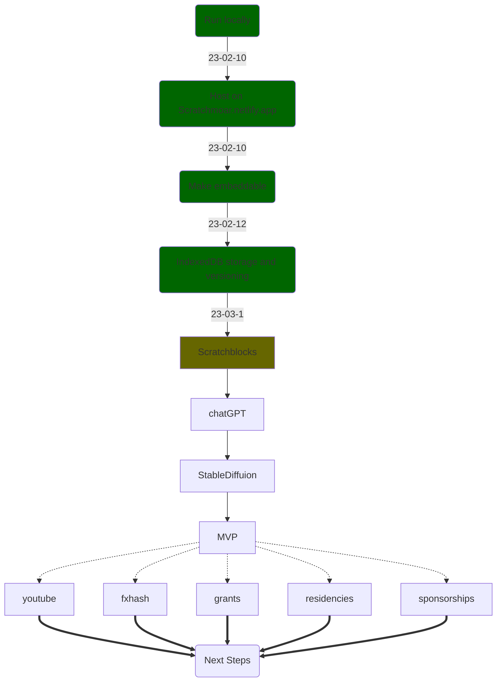

# Scratchmoar - Magic backwards compatible Scratch addons

### Video Demo

https://user-images.githubusercontent.com/69949201/223190423-109484d7-a764-48d8-9ad7-ef421da6825e.mp4

# Features
- Save, load, update unlimited snapshots in the same project...inside the browser!
- Autosaving/autoloading

<br>
<br>
<br>

---

<br>
<br>
<br>

# Local development
## Requirements
- [NodeJS](https://nodejs.org/en/download/)

## Setup
```bash
# Install dependencies
npm i

# Start a local server at http://localhost:8000
npm start
```

# Developing
- Visit any of these to develop the extension live:
  - [http://localhost:8000](http://localhost:8000)
  - [https://scratchmoar.netlify.app/editor.html?extension=http://localhost:8000/src/scratchmoar.js](https://scratchmoar.netlify.app/editor.html?extension=http://localhost:8000/src/scratchmoar.js)
  - [https://turbowarp.org/editor/?extension=http://localhost:8000/src/scratchmoar.js](https://turbowarp.org/editor/?extension=http://localhost:8000/src/scratchmoar.js)

# Troubleshooting
- If you get any weirdness in the npm console, try clearing .parcel-cache
- If you get weirdness in devtools (especially on first loading), try loading another snapshot or clearing them all
- Add `&reset` to URL to force clear everything incase you accidently corrupt IndexedDB while developing


<br>
<br>
<br>

---

<br>
<br>
<br>

# Roadmap
Scratchmoar is an ambitious project to add AI tools to Scratch in a backwards compatible way. Some ideas include:
- Generate sprites with Stable Diffusion or DALL-E
- Code using [[scratchblocks]](https://github.com/scratchblocks/scratchblocks) syntax (using text instead of blocks)
  - This will make Backpack redundant as you'll then be able to just copy/paste text
- Code with ChatGPT


